# `<tool_call>` 首 token 电路定位最终交付（final）

本目录是单目录可读交付包：只看这里即可理解实验设计、因果证据、图表解释和最终结论。

## 1. 任务目标与边界
- 目标：定位 Qwen3-1.7B 在 assistant 首 token 位置是否选择 `<tool_call>` 的内部因果组件与路径。
- 数据：164 对 clean/corrupt 配对样本，pair 内 token 长度对齐。
- 边界：仅做定位/寻找（行为验证、路径补丁、组件筛选、充分性/必要性、语义探针），不做模型编辑。

## 2. 实验设置
- 模型：`/root/data/Qwen/Qwen3-1.7B`
- 决策位：assistant 首 token（输入末位 logits）
- 主指标：`PD_tool = mean(P_clean(tool)-P_corr(tool))`
- 其他指标：`PairSignAcc`, `MarginSep`, `Recovery`, `Necessity Drop`
- 实现细节：`batch=1 + logits_to_keep=1`（仅降低显存，不改变实验定义）

## 3. 基线行为（164 对）
- Clean 命中 `<tool_call>`：**87.80%**
- Corrupt 非 `<tool_call>`：**82.93%**
- Pair 同时满足：**70.73%**
- `PD_tool`：**0.605372**；`PairSignAcc`：**0.707317**；`MarginSep`：**4.898819**

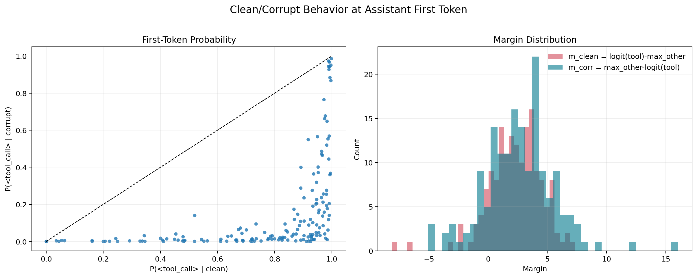

## 4. AP/CT 因果量定义与定位结果
### 4.1 `AP Impact` 与 `CT Rescue` 是怎么做的
- **AP Impact（直接路径）**：对单组件 `C`，将 clean 前向中该组件在决策位的激活替换为同 pair 的 corrupt 激活，然后只读首 token 指标。
- 定义：`AP_Impact(C) = PD_unpatched - PD_patch(C->corr)`。数值越大，表示该组件被破坏后 `PD_tool` 下降越多，因果贡献越大。
- **CT Rescue（条件路径）**：固定 key MLP=`MLP27`，先破坏组件 `C`，再把 `MLP27` 恢复为 clean，观察恢复量。
- 定义：`CT_Rescue(C|MLP27)=PD_patch(C->corr, MLP27->clean)-PD_patch(C->corr)`。数值越大，表示 `C` 的作用更可能通过 `MLP27` 传递。
- 直观理解：AP 看“直接破坏后掉多少”；CT 看“通过关键下游能救回多少”。
- 图示按参考论文 `logits-ipp` 风格合并：列 `0..15` 是 attention heads，最右列 `mlp` 是同层 MLP 的 AP 影响。

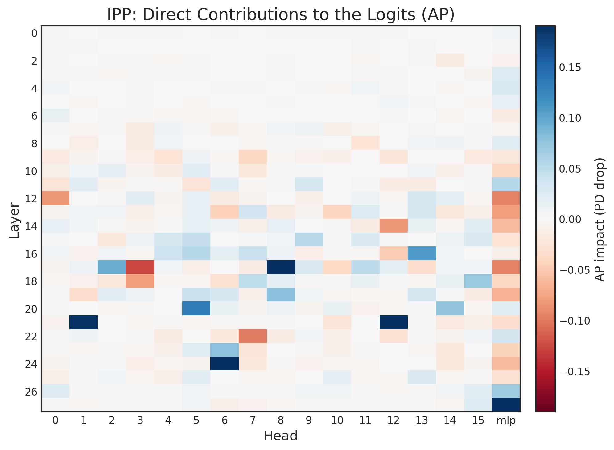

| Top Head | Layer | Head | AP Impact | CT Rescue |
| --- | --- | --- | --- | --- |
| L17H8 | 17 | 8 | 0.216635 | 0.091230 |
| L24H6 | 24 | 6 | 0.190929 | 0.113986 |
| L21H12 | 21 | 12 | 0.189301 | 0.084102 |
| L21H1 | 21 | 1 | 0.187903 | 0.099647 |
| L20H5 | 20 | 5 | 0.132976 | 0.065410 |
| L16H13 | 16 | 13 | 0.107389 | 0.048572 |
| L17H2 | 17 | 2 | 0.095159 | 0.041062 |
| L19H8 | 19 | 8 | 0.080153 | 0.037212 |
| L23H6 | 23 | 6 | 0.077631 | 0.041604 |
| L20H14 | 20 | 14 | 0.075424 | 0.026127 |
| L18H15 | 18 | 15 | 0.070722 | 0.017678 |
| L16H5 | 16 | 5 | 0.054290 | 0.012116 |

| Top MLP | Layer | AP Impact | CT Rescue |
| --- | --- | --- | --- |
| MLP27 | 27 | 0.192467 | 0.192467 |
| MLP26 | 26 | 0.068284 | -0.049124 |
| MLP11 | 11 | 0.054923 | -0.005127 |
| MLP22 | 22 | 0.034924 | 0.021026 |
| MLP4 | 4 | 0.029557 | 0.018723 |
| MLP3 | 3 | 0.025919 | 0.012197 |
| MLP8 | 8 | 0.021635 | 0.025188 |
| MLP20 | 20 | 0.019758 | -0.019543 |
| MLP5 | 5 | 0.015628 | 0.013287 |
| MLP0 | 0 | 0.007646 | 0.004305 |

### 4.2 关于 `CT MLP Rescue Heatmap` 里 `MLP27` 自身项
- 你提出的问题是正确的：key MLP 自身那一行本质是**控制项（self-control）**，不是上游组件定位证据。
- 在 `C=MLP27` 时，实验变成“先破坏 MLP27，再恢复 MLP27”，该值主要用于 sanity-check，不应与上游层同等解读。
- 因此在下图里我把 `MLP27` 自身行**显式屏蔽**（masked），只保留其余层的可解释结果。

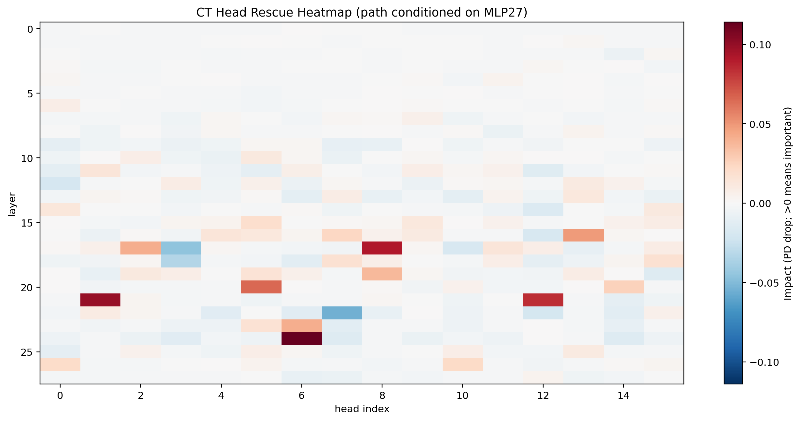

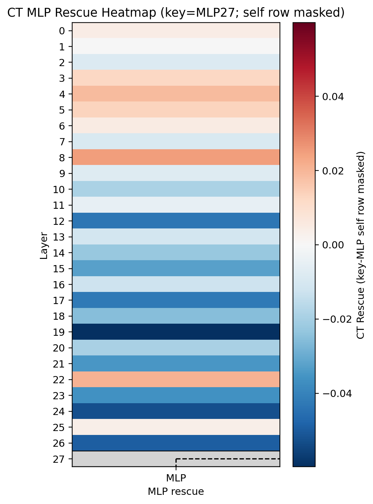

## 5. 概率图重排（按你的建议做了“显著样本聚焦”）
### 5.1 处理策略
- 先计算每个 pair 的差异 `delta = p_clean - p_corr`。
- 去掉低差异尾部（最低 25%），只保留显著样本：**123/164**，阈值 `delta >= 0.437`。
- 对切片图采用重排序规则：`p_suff desc, then p_clean desc, then p_corr asc`，并在主线使用 7 点滑窗平滑（raw 曲线保留淡色）。

### 5.2 更新后的图
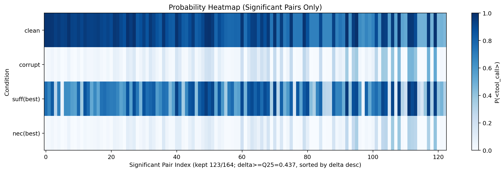

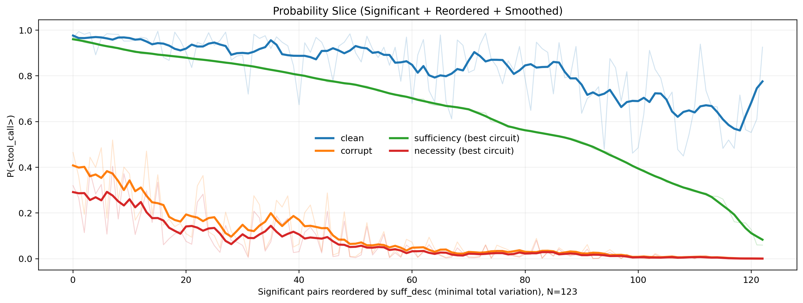

解释：这两张图已经剔除了低差异段，能更清楚看到 clean/corrupt/suff/nec 的结构性差异，不再被弱信号列稀释。

## 6. 候选电路充分性/必要性（含解释）
- 最优候选：`heads=32`, `mlps=4`, `recovery=0.7671`, `nec_drop=0.6342`。
- **Recovery 高**表示只保留这组电路就能恢复大部分 clean 能力（充分性证据）。
- **NecDrop 高**表示只破坏这组电路就能显著损伤行为（必要性证据）。
- 两者同时成立，说明该电路不仅“相关”，而且具备因果解释力。

| Heads | MLPs | Recovery | NecDrop | PD_suff | PD_nec | Score |
| --- | --- | --- | --- | --- | --- | --- |
| 32 | 4 | 0.7671 | 0.6342 | 0.4644 | -0.0288 | 0.8965 |
| 32 | 6 | 0.7671 | 0.6325 | 0.4644 | -0.0271 | 0.8952 |
| 32 | 3 | 0.7070 | 0.6383 | 0.4280 | -0.0329 | 0.8634 |
| 32 | 2 | 0.6997 | 0.6294 | 0.4236 | -0.0240 | 0.8529 |
| 24 | 4 | 0.5646 | 0.6311 | 0.3418 | -0.0257 | 0.7671 |
| 24 | 6 | 0.5646 | 0.6279 | 0.3418 | -0.0225 | 0.7652 |
| 24 | 3 | 0.5092 | 0.6340 | 0.3083 | -0.0286 | 0.7303 |
| 24 | 2 | 0.5092 | 0.6279 | 0.3083 | -0.0225 | 0.7268 |

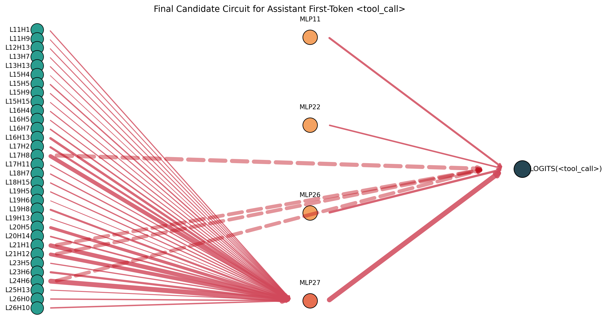

## 7. 统计显著性（bootstrap，3000 次，含解释）
- Clean hit：`87.84%`，95%CI=`[82.32%, 92.68%]`
- Corr non-tool：`82.99%`，95%CI=`[76.83%, 88.41%]`
- Pair success：`70.83%`，95%CI=`[64.02%, 78.05%]`
- PD_base：`0.605861`，95%CI=`[0.562437, 0.647070]`
- PD_suff：`0.464956`，95%CI=`[0.427995, 0.500310]`
- PD_nec：`-0.028764`，95%CI=`[-0.035652, -0.022582]`
- Recovery：`0.767585`，95%CI=`[0.725885, 0.808674]`
- Necessity Drop：`0.634625`，95%CI=`[0.591617, 0.674443]`

- 解释：大部分关键组件 `P_boot(<=0)=0`，意味着在重采样下其正向影响稳定，不是偶然样本波动。
| Component | Impact Mean | 95% CI | P_boot(<=0) |
| --- | --- | --- | --- |
| L17H8 | 0.217771 | [0.193361, 0.241828] | 0.0000 |
| MLP27 | 0.192467 | [0.167632, 0.217299] | 0.0000 |
| L24H6 | 0.191923 | [0.166738, 0.218128] | 0.0000 |
| L21H12 | 0.191338 | [0.170191, 0.212531] | 0.0000 |
| L21H1 | 0.189789 | [0.166953, 0.211393] | 0.0000 |
| L20H5 | 0.134580 | [0.119366, 0.150826] | 0.0000 |
| L16H13 | 0.109229 | [0.093282, 0.126339] | 0.0000 |
| L17H2 | 0.097329 | [0.084861, 0.109699] | 0.0000 |
| L19H8 | 0.082232 | [0.071900, 0.093056] | 0.0000 |
| L23H6 | 0.079800 | [0.069299, 0.090168] | 0.0000 |
| L20H14 | 0.077898 | [0.069160, 0.086634] | 0.0000 |
| L18H15 | 0.073108 | [0.062502, 0.084462] | 0.0000 |
| MLP26 | 0.068284 | [0.059630, 0.077603] | 0.0000 |
| L16H5 | 0.055791 | [0.047354, 0.064584] | 0.0000 |
| MLP11 | 0.054923 | [0.045325, 0.064926] | 0.0000 |
| MLP22 | 0.034924 | [0.027315, 0.042669] | 0.0000 |
| MLP4 | 0.029557 | [0.024986, 0.034108] | 0.0000 |
| MLP3 | 0.025919 | [0.022297, 0.029584] | 0.0000 |

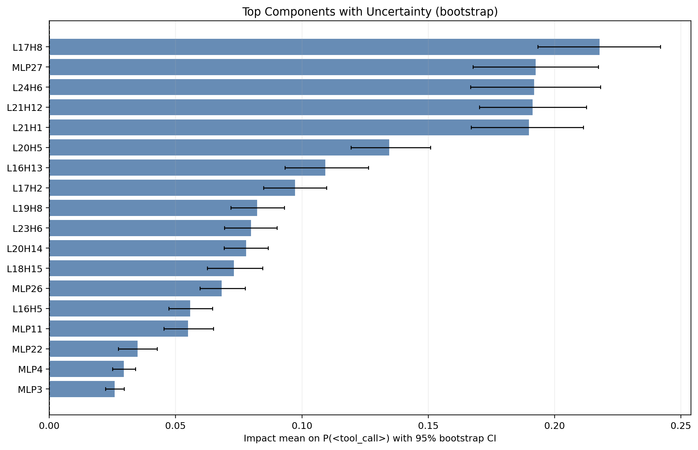

## 8. 多关键 MLP 面板与“相关性图参数”说明
### 8.1 面板图（色条已重排，避免遮挡）
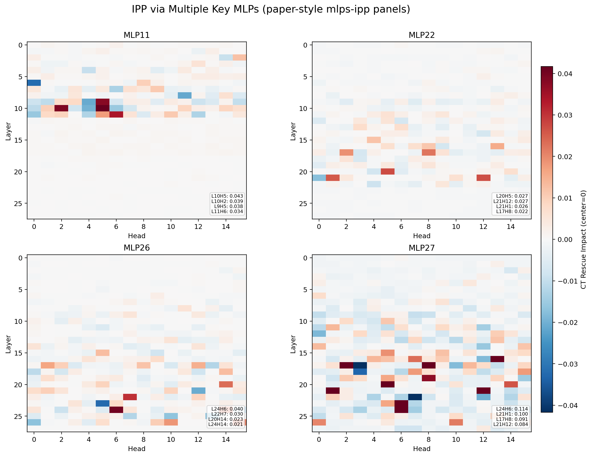

### 8.2 你问的相关性图（`Correlation: AP Head Impact vs CT Rescue`）参数解释
- 对每个 key MLP（如 MLP11/22/26/27），构造两组长度为 `28层×16头=448` 的向量：
  - `x`: 全部头的 `AP Impact`；
  - `y`: 在该 key MLP 条件下的全部头 `CT Rescue`。
- 图中柱高是 `Pearson r(x,y)`：
  - `r` 越接近 1，说明 AP 与 CT 排序越一致（同一批头既有直接影响，又经该 key MLP 传递）。
  - `r` 近 0，说明两者关联弱（该 key MLP 可能不是主传递通道）。
- `p-value`：双侧 t 检验；`95% CI`：Fisher z 变换后反变换得到。

参数与表字段一一对应（你可直接对照 `tables/mlps_ipp_ap_ct_correlation_stats.csv`）：
- `key_mlp`：CT 条件补丁中的 key MLP 层号（如 27 代表 `MLP27`）。
- `pearson_r_ap_vs_ct`：相关系数 `r = corr(x,y)`，范围 `[-1,1]`。
- `p_value_two_sided`：检验零假设 `H0: r=0` 的双侧显著性概率；越小越显著。
- `r_ci_low, r_ci_high`：`r` 的 95% 置信区间上下界（Fisher z）。
- `n_heads`：参与相关计算的 head 数；本实验固定为 `28×16=448`。

如何判断“有效”：
- 若 `|r|` 大、且 `p_value_two_sided < 0.05`，并且 CI 不跨 0，可认为 AP 与 CT 在该 key MLP 下有稳定一致性。
- 若 `r` 小、`p` 大或 CI 跨 0，则只能说明证据弱，不能当作主路径依据。

| Key MLP | Pearson r | p-value | 95% CI | n_heads |
| --- | --- | --- | --- | --- |
| MLP11 | 0.0883 | 6.18e-02 | [-0.0044, 0.1795] | 448 |
| MLP22 | 0.6784 | 1.04e-61 | [0.6251, 0.7255] | 448 |
| MLP26 | 0.1337 | 4.58e-03 | [0.0416, 0.2236] | 448 |
| MLP27 | 0.9499 | 2.15e-227 | [0.9400, 0.9582] | 448 |

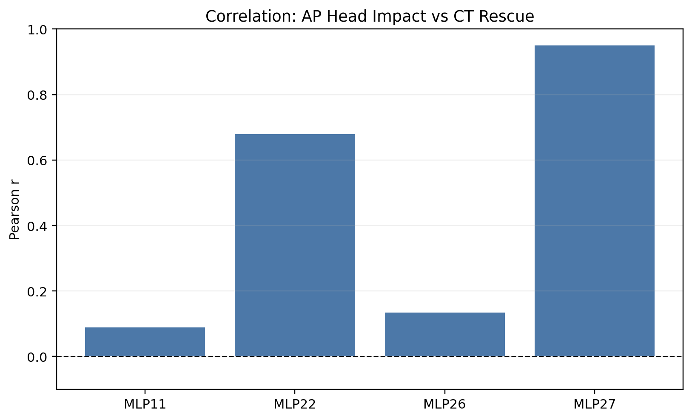

- 解释：MLP27 (`r≈0.95`) 与 MLP22 (`r≈0.68`) 显著高，说明它们更像主路径；MLP11 相关性弱且边缘不显著。

| Overlap | MLP11 | MLP22 | MLP26 | MLP27 |
| --- | --- | --- | --- | --- |
| MLP11 | 1.00 | 0.03 | 0.00 | 0.00 |
| MLP22 | 0.03 | 1.00 | 0.23 | 0.33 |
| MLP26 | 0.00 | 0.23 | 1.00 | 0.33 |
| MLP27 | 0.00 | 0.33 | 0.33 | 1.00 |

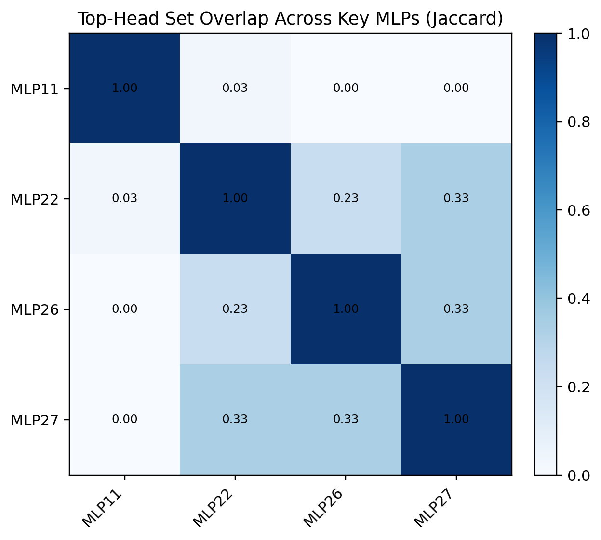

## 9. 最终候选电路与探针示例
- Head 节点（32个）：
L24H6, L17H8, L21H1, L21H12, L20H5, L16H13, L17H2, L23H6, L19H8, L20H14, L18H15, L16H7, L18H7, L15H5, L16H5, L15H9, L17H11, L19H5, L16H4, L26H0, L13H13, L13H7, L12H13, L23H5, L19H13, L11H9, L25H13, L11H1, L19H6, L15H15, L15H4, L26H10

- MLP 节点（4个）：
MLP11, MLP22, MLP26, MLP27

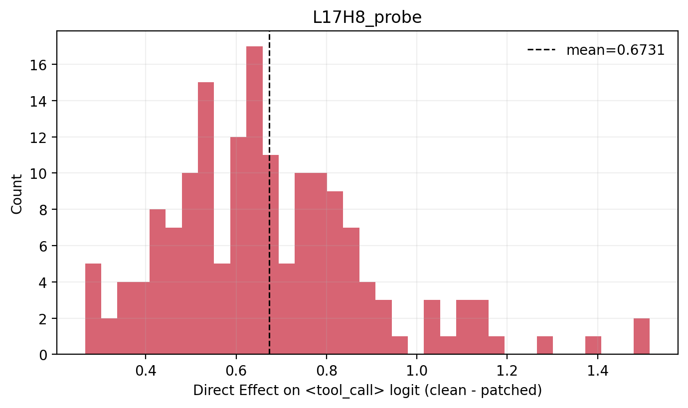

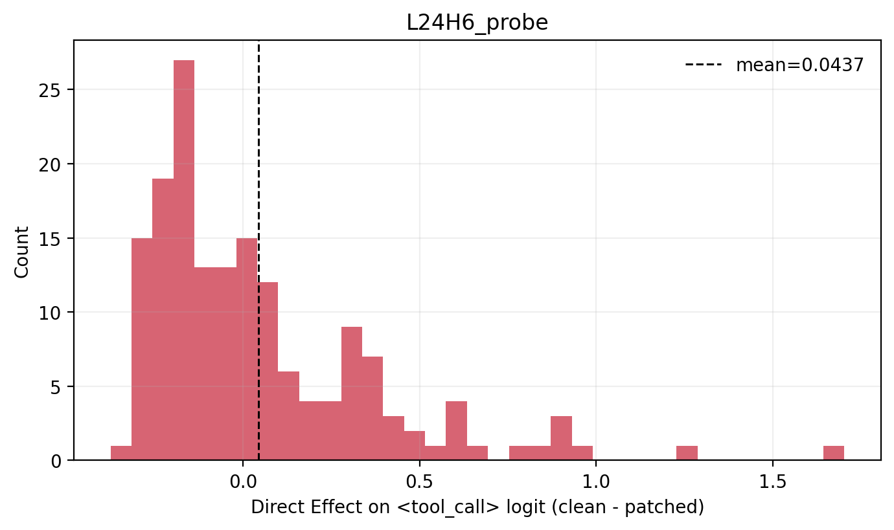

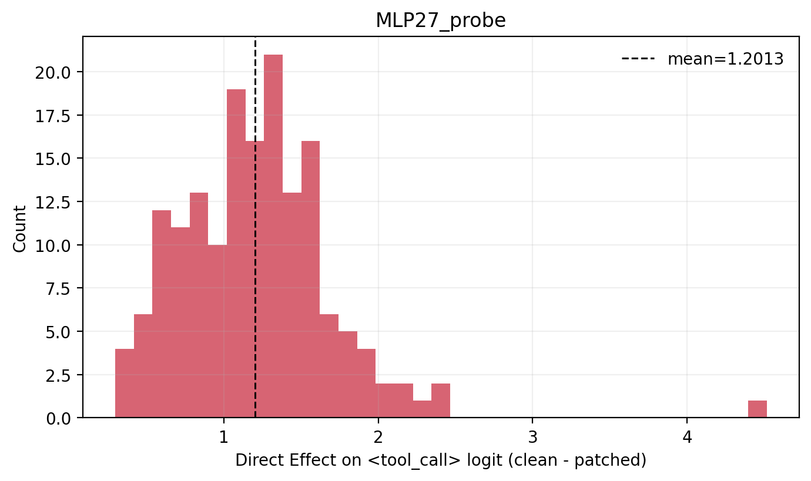

## 10. 目录说明
- `figs/`: 关键图（含重排后的 focus 图和修正版 v3 面板图）
- `tables/`: 核心 CSV（含 bootstrap、component CI、相关性统计）
- `scripts/`: 复现实验脚本

## 11. 一句话总结
`<tool_call>` 首 token 决策由中后层注意力头与末层关键 MLP（尤其 MLP27）构成的稀疏电路主导，且充分性、必要性、bootstrap 显著性与多 key MLP 对齐分析共同支持该结论。

## 12. 反向路径电路（新增，论文 Figure 3 风格）
- 目标：从 logits 反向定位一条最强 `Head -> MLP -> logits` 路径，并画出 A/B/C 三联图。
- 自动选中主路径：`L24H6 -> MLP27 -> logits`。
- 关键指标（全 164 对）：
  - `PD_base`: 0.605372
  - patch `(MLP27, logits)` 后：`PD=0.413638`（drop=0.191734）
  - patch `L24H6` 后：`PD=0.412868`（drop=0.192504）
  - patch `L24H6` 且恢复 `MLP27` 后：`PD=0.532256`（`CT rescue=0.119388`，约占 head drop 的 62.0%）

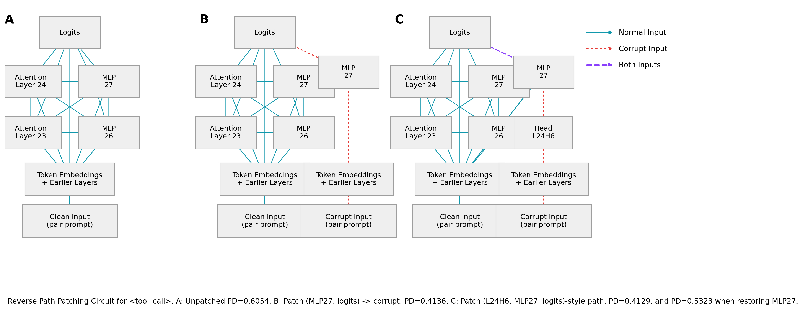

- 新增产物：
  - `tables/reverse_selected_path.csv`
  - `tables/reverse_path_metrics.csv`
  - `tables/reverse_top_heads_via_key_mlp.csv`
  - `scripts/reverse_path_circuit.py`

## 13. 反向路径电路 v2（更接近论文电路结构）
- 你反馈“单链路太简单”后，新增了 **两级 MLP + 两个关键头** 的反向电路：
  - `L24H6 -> MLP27 -> logits`
  - `L20H5 -> MLP22 -> MLP27 -> logits`
- 关键数值（全 164 对）：
  - `PD_base = 0.605372`
  - `patch (MLP27, logits)`：`PD=0.413638`（drop `0.191734`）
  - `patch L24H6`：`PD=0.412868`；`+ restore MLP27`：`PD=0.532256`（rescue `0.119388`）
  - `patch L20H5`：`PD=0.477197`；`+ restore MLP22`：`PD=0.504070`；`+ restore (MLP22+MLP27)`：`PD=0.546500`

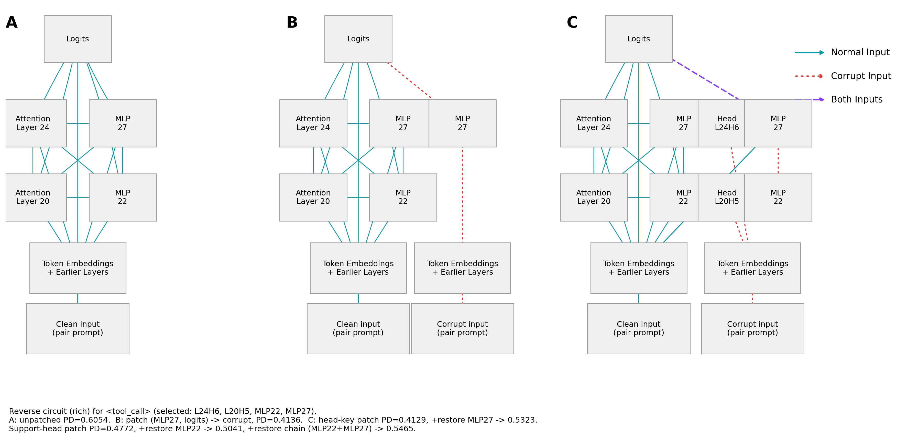

- v2 新增产物：
  - `tables/reverse_rich_selected_circuit.csv`
  - `tables/reverse_rich_path_metrics.csv`
  - `tables/reverse_rich_path_deltas.csv`
  - `scripts/reverse_path_circuit_rich.py`

## 14. 多跳逐层回溯（新增）
- 目标：不只看单个 head/MLP，而是从 `MLP27` 出发，保留大量正向 head，再递归回溯上游 MLP（layer-by-layer）。
- 脚本：`scripts/reverse_multihop_trace.py`

### 14.1 广覆盖回溯（depth=2）
- 运行设置：`root=MLP27`, `max_depth=2`, `top_upstream_mlps=2`, `root_heads=24`
- 访问到的 key MLP：`MLP27 -> {MLP8, MLP4} -> {MLP6, MLP1, MLP0}`
- 边数量：
  - `head -> mlp`: 72
  - `mlp -> mlp`: 9
  - `mlp -> logits`: 3
- `MLP27` 的正向 head 边数：**24**

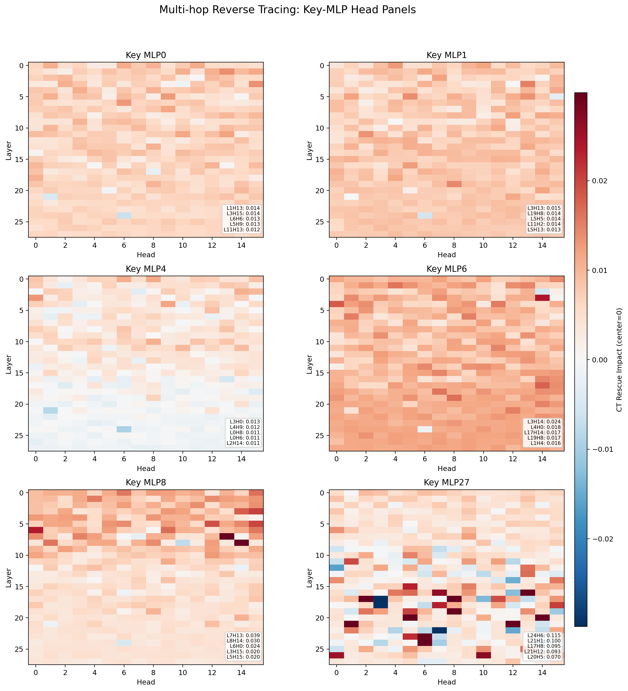

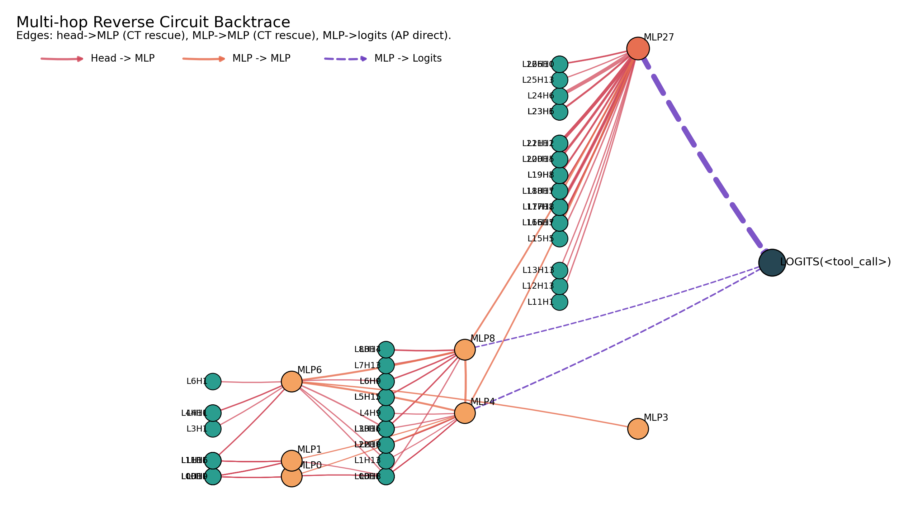

- 产物：
  - `tables/reverse_multihop_edges.csv`
  - `tables/reverse_multihop_nodes.csv`
  - `tables/reverse_multihop_summary.csv`

### 14.2 中后层优先回溯（把 MLP22 分支纳入）
- 运行设置：`root=MLP27`, `max_depth=1`, `top_upstream_mlps=3`, `min_upstream_layer=12`
- 访问到的 key MLP：`MLP27, MLP22, MLP25`
- `MLP27` 的上游 MLP 边（CT）：
  - `MLP22 -> MLP27` (`0.0269`)
  - `MLP25 -> MLP27` (`0.0098`)
- `MLP22` 的上游 MLP（CT）示例：
  - `MLP20` (`0.0249`), `MLP15` (`0.0195`), `MLP13` (`0.0174`)

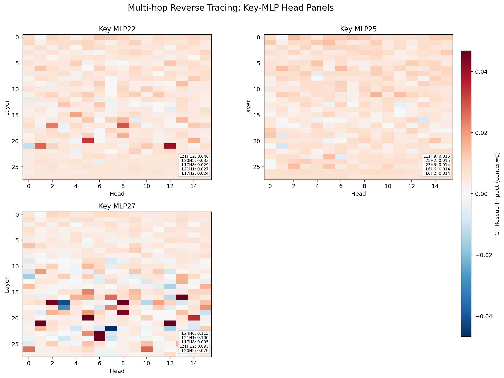

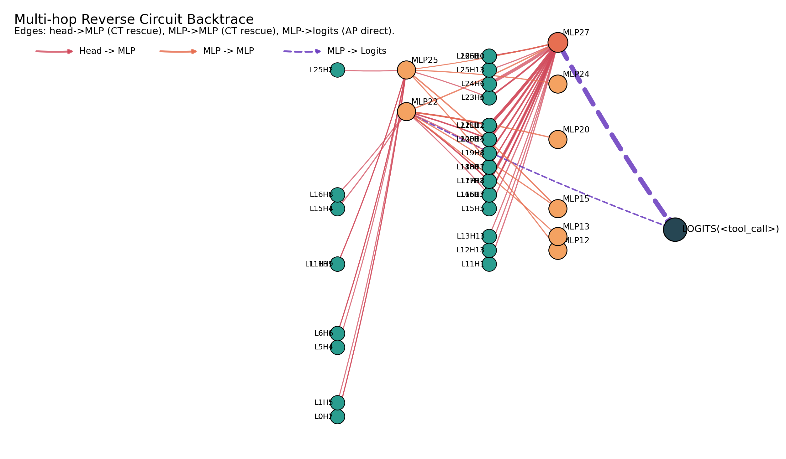

- 产物：
  - `tables/reverse_multihop_late_d1_edges.csv`
  - `tables/reverse_multihop_late_d1_nodes.csv`
  - `tables/reverse_multihop_late_d1_summary.csv`
